# Deployment of 3 Tier Java Web App on Amazon Elastic Beanstalk with Terraform

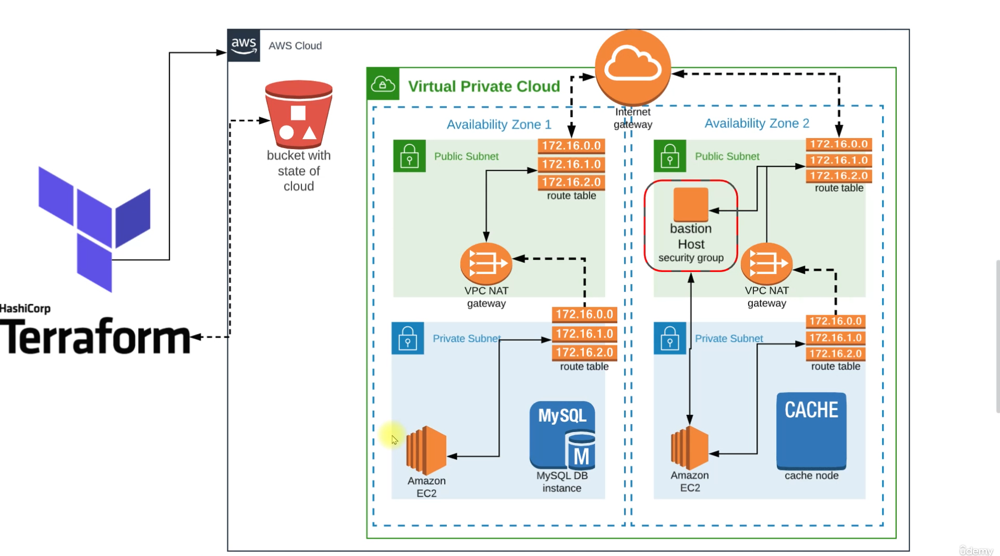

## Pre-requisites

* AWS Account
* GitHub account
* Terraform, Maven, JDK installed locally
* Any IDE (VS Code, IntelliJ, etc)

## Plan of Execution

* Create S3 Bucket with Boto3
* Setup Terraform with Backend & Providers
* Setup Variables
* Manage Key Pairs
* Setup VPC (Secure and Highly available)
* Manage Security Groups
* Provision Backend Services (RDS MySQL, ElastiCache, ActiveMQ)
* Provision Beanstalk Environment
* Setup a Bastion Host
* Artifact Deployment
* Validate & Delete Resources

### Step-1: Create a repository in GitHub

* We will create a repo in GitHub and name it as `terraform-aws-vprofile`.

* You can make it private not to expose any Access keys you are using, since my AWS credentials are configured with awscli, I will create this repo as public.

### Step-2: Clone the repo to your local

* We will clone the repository to the IDE that we will be using. I will be using "VS Code" for this project.

### Step-3: Terraform Setup

* We need to install Terraform and awscli locally for this project. You can follow the documentation to do so.

[Install Terraform](https://developer.hashicorp.com/terraform/tutorials/aws-get-started/install-cli)

[Install AWSCLI](https://docs.aws.amazon.com/cli/latest/userguide/getting-started-install.html)

* You also need to create an IAM user with Programmatic Access keys. Download credentials. Configure aws from cli:

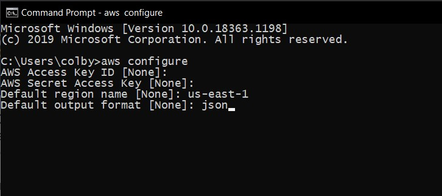

### Step-4: Create S3 Bucket with Boto3 and Setup Terraform for Backend & Providers

* First we will create an S3 bucket to store the state in AWS. I will create bucket with Python Boto3 script:

```sh
# pip install awscli boto3
import boto3

s3_bucket_name = 'javaweb-98'     # Make sure to give it a unique name otherwise it won't work
region = 'us-east-1'              # You can also change your region if you want

def create_s3_bucket():
    s3_client = boto3.client('s3', region_name=region)

    s3_client.create_bucket(Bucket=s3_bucket_name)
    print(f"S3 bucket {s3_bucket_name} created")

create_s3_bucket()
```
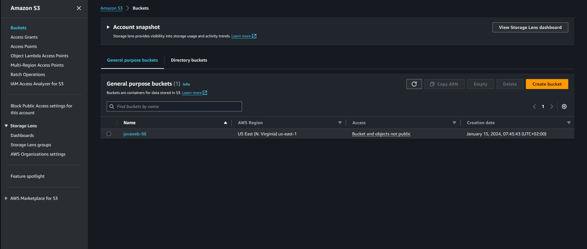

* Create `backend.tf` file under `terraform-aws-vprofile` repo with below content:

```sh
terraform {
  backend "s3" {
    bucket  = "javaweb-98"         # Replace with your bucket name
    key     = "terraform.tfstate"
    region  = "us-east-1"
    encrypt = true
  }
}
```
* Create `providers.tf` file with the following steps:

```sh
terraform {
  required_providers {
    aws = {
      source  = "hashicorp/aws"
      version = "~> 5.0"
    }
  }
}

provider "aws" {
  region = var.region
}
```

* Go to project directory and run `terraform init` to initialize backend + providers.

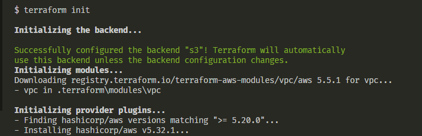

### Step-5: Setup Variables

* We will create a highly available infrastructure for our vprofile project: a VPC with 3 Public subnets and 3 Private subnets, also Elasticache, ActiveMQ and RDS MySQL services for our application. To be able to create a reusable code, we will use variables in our Terraform code.

* Create `variables.tf` file.

```sh
variable "region" {}
variable "amis" {
  type = map(string)
}
variable "priv_key_path" {}
variable "pub_key_path" {}
variable "user" {}
variable "myIP" {}
variable "rmquser" {}
variable "rmqpass" {}
variable "dbuser" {}
variable "dbpass" {}
variable "dbname" {}
variable "instance_count" {}
variable "vpc_name" {}
variable "zone1" {}
variable "zone2" {}
variable "zone3" {}
variable "vpcCIDR" {}
variable "pubSub1CIDR" {}
variable "pubSub2CIDR" {}
variable "pubSub3CIDR" {}
variable "privSub1CIDR" {}
variable "privSub2CIDR" {}
variable "privSub3CIDR" {}
```

* Create `terraform.tfvars` file to assign the variables with values.

```sh
region = "us-east-1"
amis = {
  us-east-1 = "ami-0c7217cdde317cfec" # Ubuntu 22.04 (64-bit)
  us-east-2 = "ami-0c7217cdde317cfec"
}
priv_key_path  = "vprofilekey"
pub_key_path   = "vprofilekey.pub"
user           = "ubuntu"
myIP           = "111.221.36.70/32" # Put your IP in here
rmquser        = "rabbit"
rmqpass        = "Gr33n@pple123456"
dbuser         = "admin"
dbpass         = "admin123"
dbname         = "accounts"
instance_count = "1"
vpc_name       = "vprofile-VPC"
zone1          = "us-east-1a"
zone2          = "us-east-1b"
zone3          = "us-east-1c"
vpcCIDR        = "172.21.0.0/16"
pubSub1CIDR    = "172.21.1.0/24"
pubSub2CIDR    = "172.21.2.0/24"
pubSub3CIDR    = "172.21.3.0/24"
privSub1CIDR   = "172.21.4.0/24"
privSub2CIDR   = "172.21.5.0/24"
privSub3CIDR   = "172.21.6.0/24"
```

### Step-6: Manage Key Pairs

* Generate an SSH key with name of `vprofilekey` as we mentioned in `terraform.tfvars` file. Go to `terraform-aws-vprofile` directory, run below command:
```sh
ssh-keygen
```
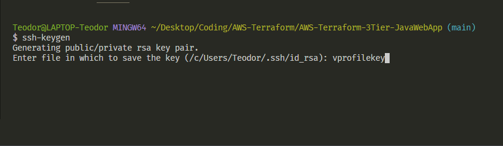

* Now we can create `keypairs.tf` file with below content. We will use `file` function to get the content from path instead of copy-pasting whole content.

```sh
resource "aws_key_pair" "vprofilekey" {
  key_name   = "vprofilekey"
  public_key = file(var.pub_key_path)
}
```

* We can commit the files to GitHub except private/public keys!!!

* Run below commands from local:
```sh
terraform init
terraform validate
terraform fmt
terraform plan
terraform apply -auto-approve
```

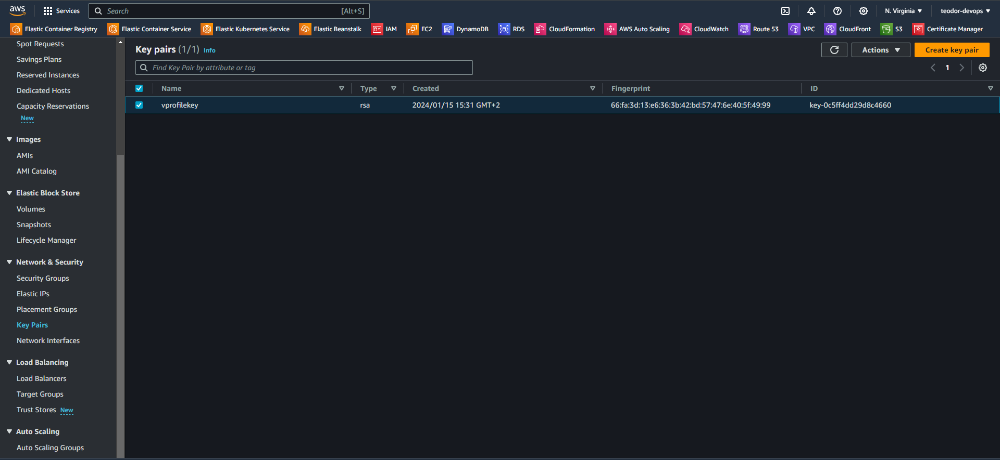

### Step-7: VPC Module & Setup

* One easy way to create resources with terraform is using modules. We will use official [VPC module](https://registry.terraform.io/modules/terraform-aws-modules/vpc/aws/latest) from AWS.

```sh
module "vpc" {
  source               = "terraform-aws-modules/vpc/aws"
  version              = "5.5.1"
  name                 = var.vpc_name
  cidr                 = var.vpcCIDR
  azs                  = [var.zone1, var.zone2, var.zone3]
  private_subnets      = [var.privSub1CIDR, var.privSub2CIDR, var.privSub3CIDR]
  public_subnets       = [var.pubSub1CIDR, var.pubSub2CIDR, var.pubSub3CIDR]
  enable_nat_gateway   = true
  single_nat_gateway   = true
  enable_dns_hostnames = true
  enable_dns_support   = true

  tags = {
    Terraform   = "true"
    Environment = "Prod"
  }
  vpc_tags = {
    Name = var.vpc_name
  }
}
```

* We will commit/push this file to remote repo.

* Since we added a new module, first we need to run:

```sh
terraform init
terraform validate
terraform fmt
terraform plan
terraform apply -auto-approve
```

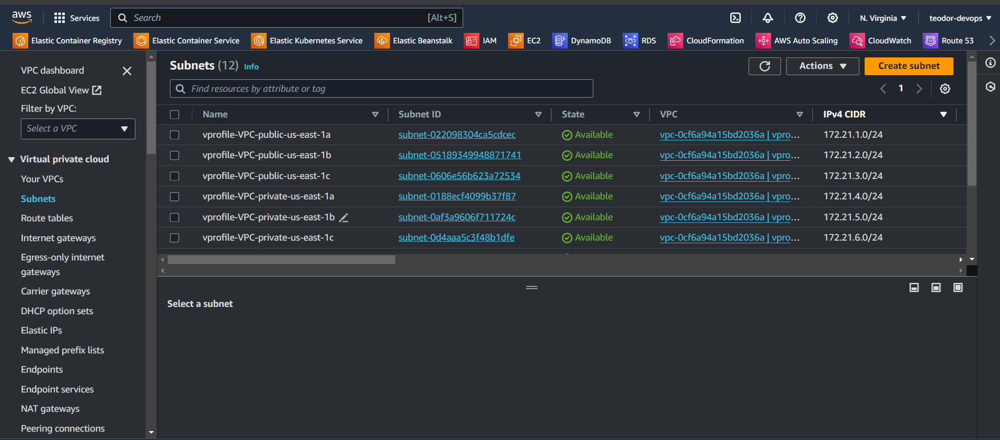

### Step-8: Manage Security Groups

We need to create `secgrp.tf` for below services:

* Beanstalk Load Balancer
* Bastion Host
* Beanstalk instances
* Backend services (Active MQ - Elasticache - RDS)

```sh
resource "aws_security_group" "vprofile-bean-elb-sg" {
  name        = "vprofile-bean-elb-sg"
  description = "Security group for Bean-ELB"
  vpc_id      = module.vpc.vpc_id

  egress {
    from_port   = 0
    to_port     = 0
    protocol    = "-1"
    cidr_blocks = ["0.0.0.0/0"]
  }

  ingress {
    from_port   = 80
    to_port     = 80
    protocol    = "tcp"
    cidr_blocks = ["0.0.0.0/0"]
  }
}

resource "aws_security_group" "vprofile-bastion-sg" {
  name        = "vprofile-bastion-sg"
  description = "Security group for Bastion Host EC2 Instance"
  vpc_id      = module.vpc.vpc_id

  egress {
    from_port   = 0
    to_port     = 0
    protocol    = "-1"
    cidr_blocks = ["0.0.0.0/0"]
  }

  ingress {
    from_port   = 22
    to_port     = 22
    protocol    = "tcp"
    cidr_blocks = [var.myIP]
  }
}

resource "aws_security_group" "vprofile-prod-sg" {
  name        = "vprofile-prod-sg"
  description = "Security group for Beanstalk Instances"
  vpc_id      = module.vpc.vpc_id

  egress {
    from_port   = 0
    to_port     = 0
    protocol    = "-1"
    cidr_blocks = ["0.0.0.0/0"]
  }

  ingress {
    from_port       = 22
    to_port         = 22
    protocol        = "tcp"
    security_groups = [aws_security_group.vprofile-bastion-sg.id]
  }
}

resource "aws_security_group" "vprofile-backend-sg" {
  name        = "vprofile-backend-sg"
  description = "Security group for ActiveMQ, ElastiCache, RDS"
  vpc_id      = module.vpc.vpc_id

  egress {
    from_port   = 0
    to_port     = 0
    protocol    = "-1"
    cidr_blocks = ["0.0.0.0/0"]
  }

  ingress {
    from_port       = 0
    to_port         = 0
    protocol        = "tcp"
    security_groups = [aws_security_group.vprofile-prod-sg.id]
  }

  ingress {
    from_port       = 3306
    to_port         = 3306
    protocol        = "tcp"
    security_groups = [aws_security_group.vprofile-bastion-sg.id]
  }
}

resource "aws_security_group_rule" "sec_group_allow_itself" {
  type                     = "ingress"
  from_port                = 0
  to_port                  = 65535
  protocol                 = "tcp"
  security_group_id        = aws_security_group.vprofile-backend-sg.id
  source_security_group_id = aws_security_group.vprofile-backend-sg.id
}
```

* Run below commands to create security groups resources:
```sh
terraform validate
terraform fmt
terraform plan
terraform apply -auto-approve
```

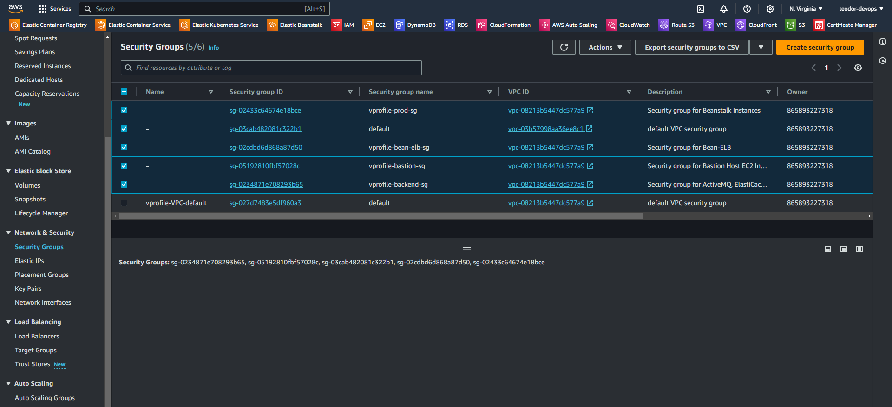

### Step-9: Provision Backend Services (RDS MySQL, ElastiCache, ActiveMQ)

* Generate a `backend-services.tf` file with the following content:

```sh
resource "aws_db_subnet_group" "vprofile-rds-subgrp" {
  name       = "vprofile-rds-subgrp"
  subnet_ids = [module.vpc.private_subnets[0], module.vpc.private_subnets[1], module.vpc.private_subnets[2]]
  tags = {
    Name = "Subnet groups for RDS"
  }
}

resource "aws_elasticache_subnet_group" "vprofile-ecache-subgrp" {
  name       = "vprofile-ecache-subgrp"
  subnet_ids = [module.vpc.private_subnets[0], module.vpc.private_subnets[1], module.vpc.private_subnets[2]]
  tags = {
    Name = "Subnet groups for ECACHE"
  }
}

resource "aws_db_instance" "vprofile-rds" {
  allocated_storage      = 20
  storage_type           = "gp2"
  engine                 = "mysql"
  engine_version         = "8.0.32"
  instance_class         = "db.t2.micro"
  db_name                = var.dbname
  username               = var.dbuser
  password               = var.dbpass
  parameter_group_name   = "default.mysql8.0"
  skip_final_snapshot    = true
  publicly_accessible    = false
  multi_az               = false
  db_subnet_group_name   = aws_db_subnet_group.vprofile-rds-subgrp.name
  vpc_security_group_ids = [aws_security_group.vprofile-backend-sg.id]
}

resource "aws_elasticache_cluster" "vprofile-cache" {
  cluster_id           = "vprofile-cache"
  engine               = "memcached"
  node_type            = "cache.t2.micro"
  num_cache_nodes      = 1
  parameter_group_name = "default.memcached1.6"
  port                 = 11211
  subnet_group_name    = aws_elasticache_subnet_group.vprofile-ecache-subgrp.name
  security_group_ids   = [aws_security_group.vprofile-backend-sg.id]
}

resource "aws_mq_broker" "vprofile-rmq" {
  broker_name        = "vprofile-rmq"
  engine_type        = "ActiveMQ"
  engine_version     = "5.15.16"
  host_instance_type = "mq.t2.micro"
  security_groups    = [aws_security_group.vprofile-backend-sg.id]
  subnet_ids         = [module.vpc.private_subnets[0]]

  user {
    username = var.rmquser
    password = var.rmqpass
  }
}
```

* Run the following commands for the backend services:
```sh
terraform validate
terraform fmt
terraform plan
terraform apply -auto-approve
```

 ->> This will take about 10-12 minutes to provision the services.


### Step-10: Beanstalk Application & Environment Setup

* Create a `bean-app.tf` file for the beanstalk application:

```sh
resource "aws_elastic_beanstalk_application" "vprofile-prod" {
  name = "vprofile-prod"
}
```
* Also build a `bean-env.tf` file for the beanstalk environment:

```sh
resource "aws_elastic_beanstalk_environment" "vprofile-bean-prod" {
  name                = "vprofile-bean-prod"
  application         = aws_elastic_beanstalk_application.vprofile-prod.name
  solution_stack_name = "64bit Amazon Linux 2 v4.3.15 running Tomcat 8.5 Corretto 11"

  setting {
    namespace = "aws:ec2:vpc"
    name      = "VPCId"
    value     = module.vpc.vpc_id
  }

  setting {
    name      = "IamInstanceProfile"
    namespace = "aws:autoscaling:launchconfiguration"
    value     = "aws-elasticbeanstalk-ec2-role"
  }

  setting {
    namespace = "aws:ec2:vpc"
    name      = "AssociatePublicIpAddress"
    value     = "false"
  }

  setting {
    namespace = "aws:ec2:vpc"
    name      = "Subnets"
    value     = join(",", [module.vpc.private_subnets[0], module.vpc.private_subnets[1], module.vpc.private_subnets[2]])
  }

  setting {
    namespace = "aws:ec2:vpc"
    name      = "ELBSubnets"
    value     = join(",", [module.vpc.public_subnets[0], module.vpc.public_subnets[1], module.vpc.public_subnets[2]])
  }

  setting {
    name      = "InstanceType"
    namespace = "aws:autoscaling:launchconfiguration"
    value     = "t2.micro"
  }

  setting {
    name      = "EC2KeyName"
    namespace = "aws:autoscaling:launchconfiguration"
    value     = aws_key_pair.vprofilekey.key_name
  }
  setting {
    name      = "Availability Zones"
    namespace = "aws:autoscaling:asg"
    value     = "Any 3"
  }

  setting {
    name      = "MinSize"
    namespace = "aws:autoscaling:asg"
    value     = "1"
  }

  setting {
    name      = "MaxSize"
    namespace = "aws:autoscaling:asg"
    value     = "4"
  }

  setting {
    name      = "environment"
    namespace = "aws:elasticbeanstalk:application:environment"
    value     = "prod"
  }

  setting {
    name      = "SystemType"
    namespace = "aws:elasticbeanstalk:healthreporting:system"
    value     = "enhanced"
  }

  setting {
    name      = "LOGGING_APPENDER"
    namespace = "aws:elasticbeanstalk:application:environment"
    value     = "GRAYLOG"
  }

  setting {
    name      = "RollingUpdateEnabled"
    namespace = "aws:autoscaling:updatepolicy:rollingupdate"
    value     = "true"
  }

  setting {
    name      = "RollingUpdateType"
    namespace = "aws:autoscaling:updatepolicy:rollingupdate"
    value     = "Health"
  }

  setting {
    name      = "MaxBatchSize"
    namespace = "aws:autoscaling:updatepolicy:rollingupdate"
    value     = "1"
  }

  setting {
    name      = "CrossZone"
    namespace = "aws:elb:loadbalancer"
    value     = "true"
  }

  setting {
    name      = "BatchSizeType"
    namespace = "aws:elasticbeanstalk:command"
    value     = "Fixed"
  }

  setting {
    name      = "StickinessEnabled"
    namespace = "aws:elasticbeanstalk:environment:process:default"
    value     = "true"
  }

  setting {
    name      = "DeploymentPolicy"
    namespace = "aws:elasticbeanstalk:command"
    value     = "Rolling"
  }

  setting {
    name      = "SecurityGroups"
    namespace = "aws:autoscaling:launchconfiguration"
    value     = aws_security_group.vprofile-prod-sg.id
  }

  setting {
    name      = "SecurityGroups"
    namespace = "aws:elbv2:loadbalancer"
    value     = aws_security_group.vprofile-bean-elb-sg.id
  }

  depends_on = [aws_security_group.vprofile-prod-sg, aws_security_group.vprofile-bean-elb-sg]
}
```
* In addition to that, we need to create a `aws-elasticbeanstalk-ec2-role` for the Instance Profile from our AWS Account!!!

1. Search for "IAM"
2. Users>Add users>username>Set permissions
3. Select Attach policies directly and add these 4 permissions (AWSElasticBeanstalkMulticontainerDocker, AWSElasticBeanstalkWebTier, AWSElasticBeanstalkWorkerTier)
[create a Role]

4. Roles>create role>{entity type: AWS service, use case: EC2>permissions:same as above}
[link Role to the User using the user ARN we just created]

5. Select Role>Trust relationships>Edit trust policy>Add a principal - {principal type: IAM Roles, ARN: user arn}>Update Policy
[Create a new environment]

6. Service access - (use an existing service role - {existing service role: Role_created, EC2 instance profile: Role_created})
[We have successfully launched an environment]

* Run below commands:
```sh
terraform validate
terraform fmt
terraform plan
terraform apply -auto-approve
```
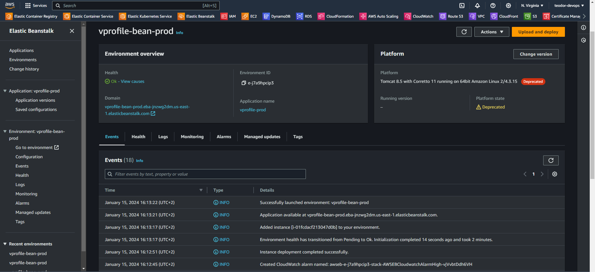

### Step-11: Setup Bastion Host & DB Initialization

* We will create a Bastion host `bastion-host.tf` file then connect to RDS instance through this instance and initialize the Database.

```sh
resource "aws_instance" "vprofile-bastion" {
  ami                    = lookup(var.amis, var.region)
  instance_type          = "t2.micro"
  key_name               = aws_key_pair.vprofilekey.key_name
  subnet_id              = module.vpc.public_subnets[0]
  count                  = var.instance_count
  vpc_security_group_ids = [aws_security_group.vprofile-bastion-sg.id]
  user_data              = templatefile("templates/db-deploy.sh", { rds-endpoint = aws_db_instance.vprofile-rds.address, dbuser = var.dbuser, dbpass = var.dbpass })

  tags = {
    Name    = "vprofile-bastion"
    Project = "vprofile"
  }

  depends_on = [aws_db_instance.vprofile-rds]
}
```

* We will use userdata script to initialize RDS. We need to get the RDS-Endpoint as an environment variable after it is created and replace it in the script to be able to connect to MySQL Database.

* Create `templates` directory in project, under the same directory create a file named as `db-deploy.sh` with below content:
```sh
sudo apt update
sudo apt install git mysql-client -y
git clone -b vp-rem https://github.com/devopshydclub/vprofile-project.git
mysql -h ${rds-endpoint} -u ${dbuser} --password=${dbpass} accounts --ssl-mode=DISABLED < /home/ubuntu/vprofile-project/src/main/resources/db_backup.sql
mysql -h ${rds-endpoint} -u ${dbuser} --password=${dbpass} accounts --ssl-mode=DISABLED
```

* Run below commands:
```sh
terraform validate
terraform fmt
terraform plan
terraform apply
```

### Step-12: Artifact Deployment

* Clone repository from below repository, we need to do some updates in `application.properties` file.

```sh
git clone -b vp-rem https://github.com/devopshydclub/vprofile-project.git
```
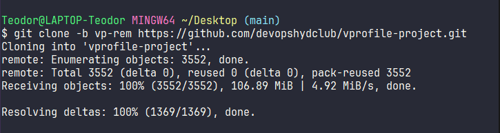

* Update the following parts in that file:

1. Replace db01 -> RDS endpoint

2. Replace mc01 -> elasticache Endpoint

3. Replace rmq01 -> Actice MQ AMQP endpoint(only take url after //) and port

```sh
rabbitmq.username=rabbit
rabbitmq.password=<replace_with_pwd_you_give_in_tf_vars>
```
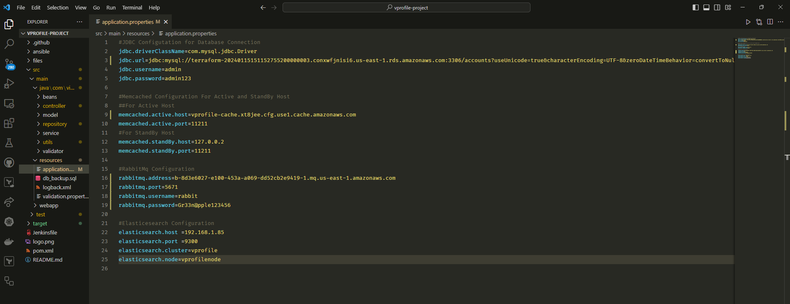

* Save and exit, then go to project directory where `pom.xml` exists and run `mvn install` to generate our artifact.

* Our artifact (vprofile-v2.war) is ready, we will upload it to Beanstalk manually.

* Go to Beanstalk from AWS Console, click on application you created by terraform. `Upload and Deploy`

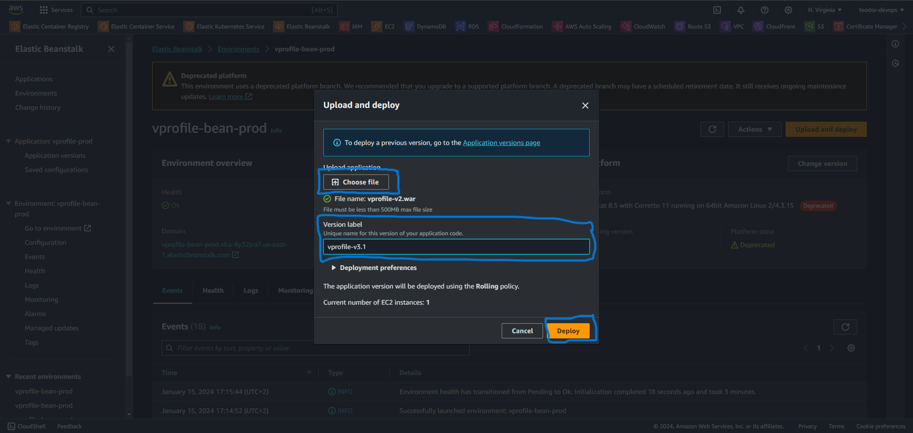


### Step-13: Validate and Clean Up

* We can validate our application now from the Browser, click on the URL given on the Beanstalk page.

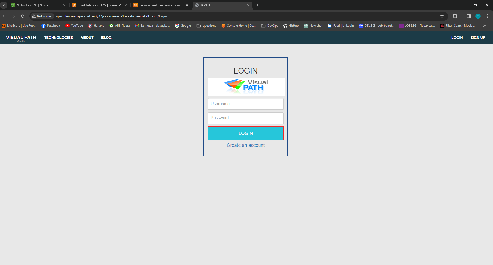

* At the end run the following commands to clean-up your AWS account.

```sh
terraform destroy -auto-approve
```
* Delete your S3 Bucket by running this Boto3 Script:

```sh
import boto3

s3_bucket_name = 'javaweb-98'
region = 'us-east-1'

def delete_s3_bucket():
    s3_client = boto3.client('s3', region_name=region)

    # Empty all objects in the bucket before deleting the bucket
    response = s3_client.list_objects(Bucket=s3_bucket_name)
    if 'Contents' in response:
        for obj in response['Contents']:
            s3_client.delete_object(Bucket=s3_bucket_name, Key=obj['Key'])

    # Delete the bucket
    s3_client.delete_bucket(Bucket=s3_bucket_name)
    print(f"S3 bucket {s3_bucket_name} deleted.")

delete_s3_bucket()
```