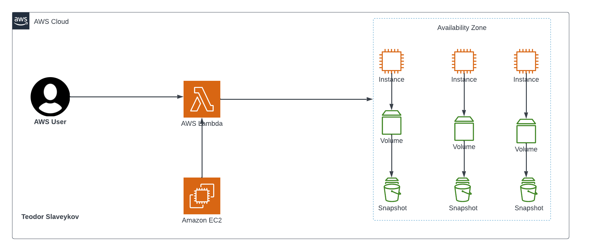
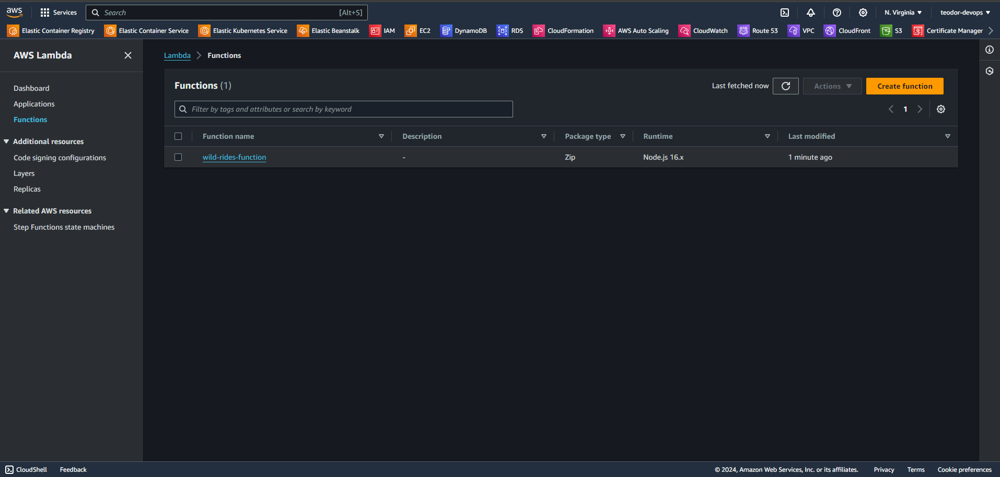
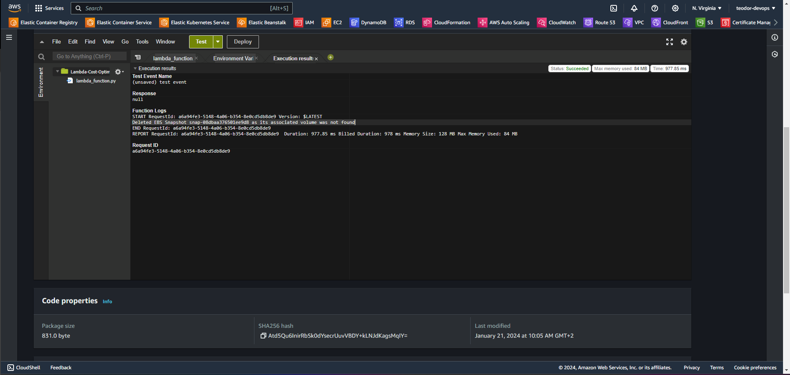

# Efficient Hidden Savings with EBS Snapshot Management

Discover a game-changing solution! We're here to make AWS cost optimization a breeze by smartly handling EBS snapshots. No more unnecessary spending—welcome to a more cost-effective cloud setup! 💰💡

## Architecture



## Prerequisites

* Basic understanding of AWS services, especially EC2 instances and EBS volumes.
* An AWS account with sufficient permissions to manage EBS snapshots and EC2 instances.
* Familiarity with Python programming and some AWS Services.
* Terraform installed on your local machine

## Step 1: Create an EC2 Instance

```sh
Name: EBS-EC2-Instance
AMI: Ubuntu 22.04 (Free Tier)
Keep the rest as default
```
## Step 2: Create a Snapshot from the EC2 Instance

* Go to the `Snapshot` section and click on `Create snapshot`.
* Select the Volume ID that is attached to the instance and click on `Create snapshot`.

## Step 3: Create the EBS Optimization Lambda Function

```sh
import boto3

def lambda_handler(event, context):
    # Initialize EC2 client
    ec2 = boto3.client('ec2')

    # Get all the EC2 snapshots owned by the Lambda function
    response = ec2.describe_snapshots(OwnerIds=['self'])

    # Get all active Instance IDs
    instance_status = ec2.describe_instances(Filters=[{'Name': 'instance-state-name', 'Values': ['running']}])
    active_instance_ids = set()

    # Extract active Instance IDs from the response
    for reservation in instance_status['Reservations']:
        for instance in reservation['Instances']:
            active_instance_ids.add(instance['InstanceId'])

    # Iterate to delete EBS snapshots not associated with volumes or associated with stopped instances
    for snapshot in response['Snapshots']:
        snapshot_id = snapshot['SnapshotId']
        volume_id = snapshot.get('VolumeId')

        if not volume_id:
            # Delete snapshots not associated with volumes
            print('Volume not found!')
            ec2.delete_snapshot(SnapshotId=snapshot_id)
            print(f'Deleted EBS Snapshot {snapshot_id} as it is not attached to any volumes')
        else:
            try:
                # Check if the volume is attached to any instances
                volume_response = ec2.describe_volumes(VolumeIds=[volume_id])

                if not volume_response['Volumes'][0]['Attachments']:
                    # Delete snapshots associated with volumes but not attached to instances
                    ec2.delete_snapshot(SnapshotId=snapshot_id)
                    print(f'Deleted EBS Snapshot {snapshot_id} as it is attached to the volume {volume_id}, but the associated EC2 instance is not running')

            except ec2.exceptions.ClientError as e:
                if e.response['Error']['Code'] == 'InvalidVolume.NotFound':
                    # Delete snapshots whose associated volume is not found
                    ec2.delete_snapshot(SnapshotId=snapshot_id)
                    print(f'Deleted EBS Snapshot {snapshot_id} as its associated volume was not found')
```

## Step 4: Create an S3 Bucket and then Launch the Terraform files

```sh
terraform init
terraform fmt # Optional
terraform validate
terraform plan
terraform apply -auto-approve
```

## Step 5: Make sure to delete/terminate your created EC2 Instance 

## Step 6: Test the function

* Navigate to AWS Lambda and see your created function



* Click on `Test` to trigger the function.



* In the AWS Console, no more snapshots were found.

## Step 7: Delete the terraform files

```sh
terraform destroy -auto-approve
```


