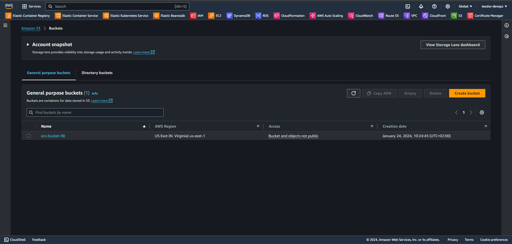
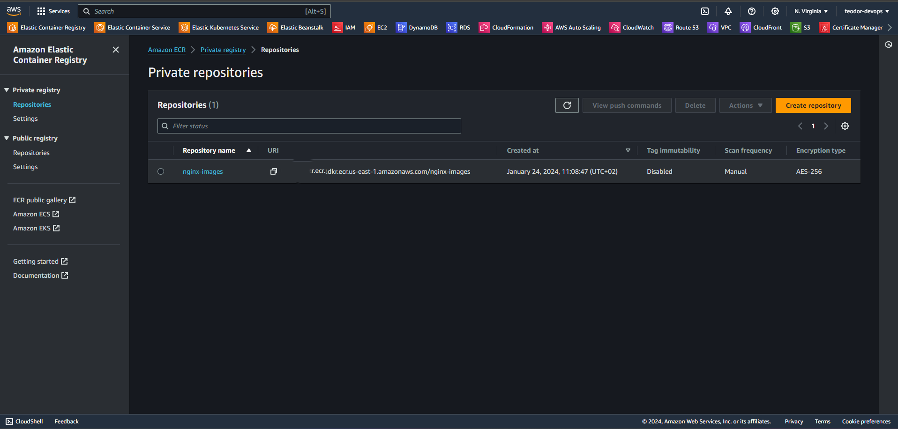
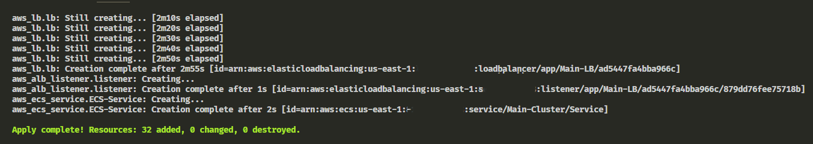
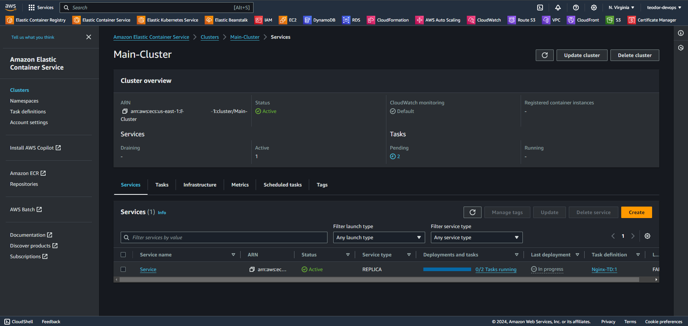

# Provisioning AWS ECS Cluster + Service with Terraform

## Prerequisites

* AWS Account 
* Terraform installed and configured

## **Step 1: Create S3 Bucket**
* Go to `AWS S3` -> Create bucket -> Give it a unique name -> Keep the rest as default. Make sure to update the name of your bucket and region in the `backend_providers.tf` file. 



## **Step 2: Create ECR Repository**
* Go to `Amazon ECR` -> Create repository -> Give it a name (my name is `nginx-images`). Make sure to update the name of your ecr repo if you use a different name in the `ecs-taskdef.tf` file.



## **Step 3: Provision the files**
* Run the following commands in your terminal:

```
terraform init
terraform fmt 
terraform validate
terraform plan
terraform apply -auto-approve
```
Allow up to 3-4 minutes for the creation process to complete!!!



* You can now see your ECS Cluster and Service running



## **Step 4: Delete the files**

* Run the following command:

```
terraform destroy -auto-approve
```

* Then go and delete your S3 Bucket and ECR Repo