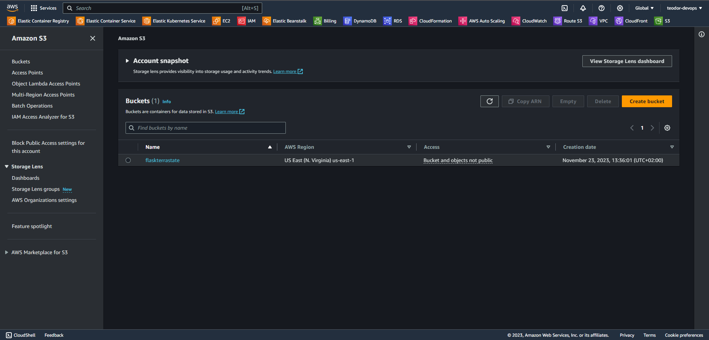
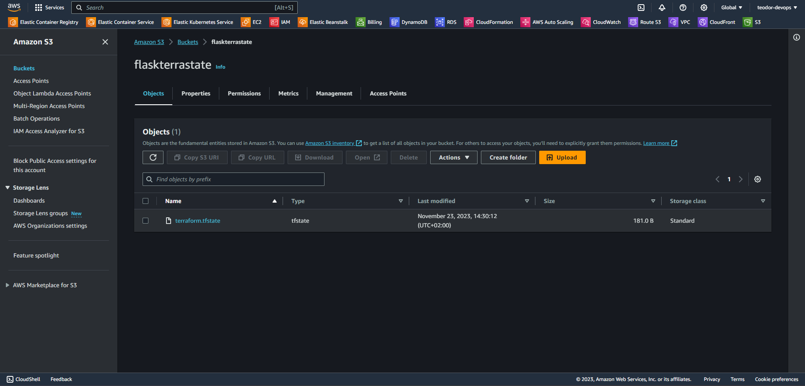

# Provisioning AWS EKS Cluster with Terraform


## **Step 1: Create S3 Bucket**
* Go to AWS S3 -> Create bucket -> Give it a unique name -> Keep the rest as default. Make sure to update the name of your bucket and region in the terraform.tf file 



## **Step 2: Run the EKS Cluster**
Run the following commands in gitbash:

```
terraform init
terraform fmt -check
terraform validate
terraform plan -out planfile
terraform apply -auto-approve -input=false -parallelism=1 planfile
```

Allow up to 15 minutes for the bucket creation process to complete!!!
After that you should see your keyfile in the S3 Bucket.



## **Step 3: Delete the EKS Cluster**

Run the following command:

```
terraform destroy -auto-approve
```