# Cloud-Native Deployment on AWS with Terraform and GitHub Actions 

In this project, I aim to explore the utilization of various AWS Serverless services, including but not limited to AWS Lambda, Amazon API Gateway, Cognito, AWS Amplify, and DynamoDB. Additionally, I will employ IAM for configuring essential roles and permissions, leverage S3 for storing Lambda functions, and utilize CodeCommit as a version control repository for the Web App. The orchestration of the entire setup will be accomplished through Terraform, complemented by the integration of GitHub Actions for Continuous Integration.

Alternatively, if you prefer a manual approach, you can follow the step-by-step instructions provided on the official AWS website: https://aws.amazon.com/getting-started/hands-on/build-serverless-web-app-lambda-apigateway-s3-dynamodb-cognito/.

Without further ado, let's get started!!!

## Prerequisites

* An AWS Account
* AWS CLI, Git & Terraform installed on your local system
* An IDE of your choice (e.g. VS Code)

## Architecture Overview

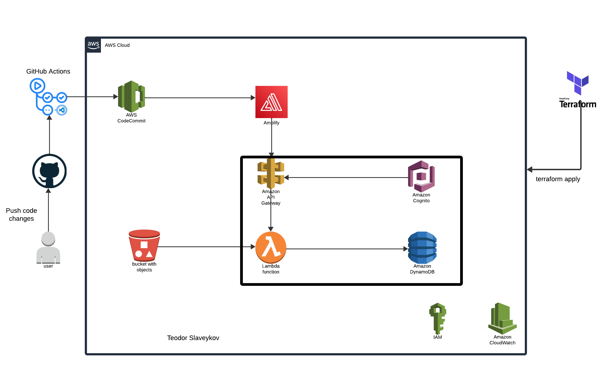

## Part 1: Create an IAM User and configure AWS CLI

* On the AWS Console, search for IAM
* Click on Users -> Create User
* Type a preferred username, e.g aws-serverless. Ensure you check “Provide user access to the AWS Management Console”. Choose a custom password for the user. You can decide to check or uncheck “Users must create a new password at next sign-in — Recommended”, It depends on your companys’ password policy for newly created users. I am leaving it unchecked. Now, Click next.

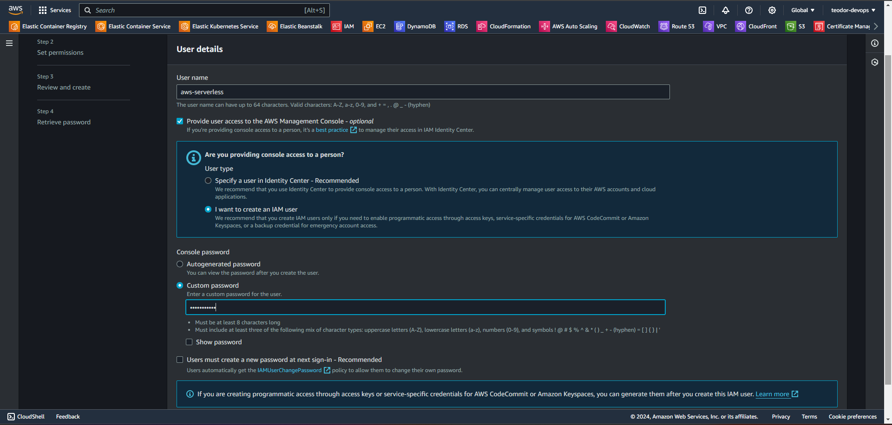

* Give the User Administrator privileges and click next.

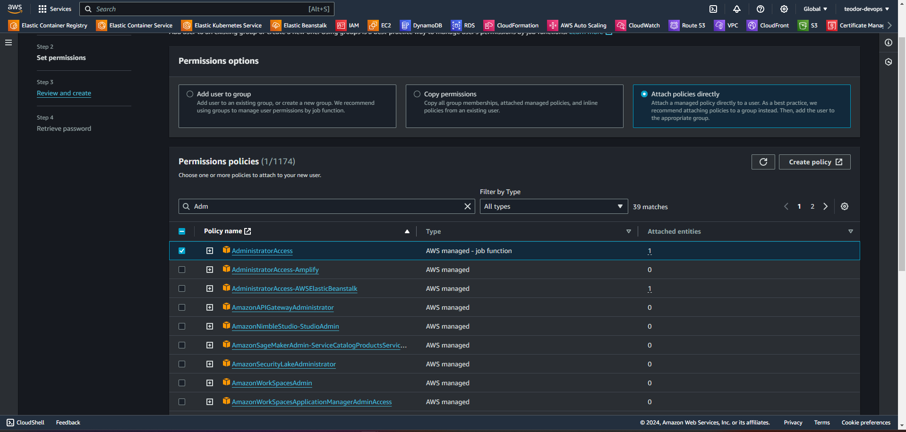

* After creating the user, click on create access key and choose “Command Line Interface (CLI)”, check the confirmation box, click next and click “Create access key”. Ensure you download the .csv file containing the access key and secret access key.

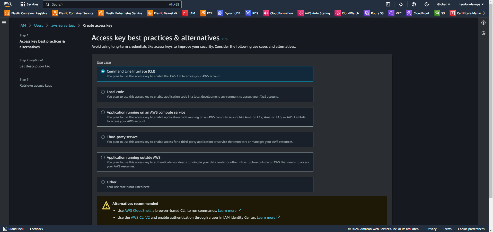

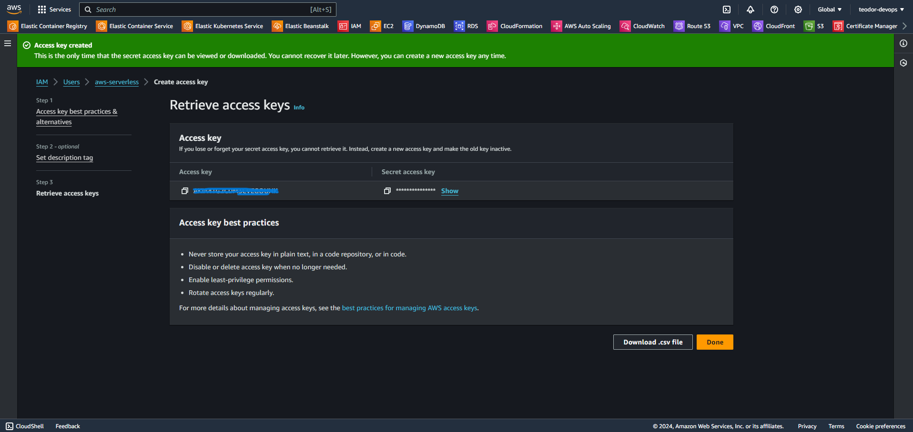

* Open your terminal (e.g. GitBash or VS Code) and type:

```sh
aws configure --profile aws-serverless
```
* Then paste the stored AWS Access Key ID and AWS Secret Access Key

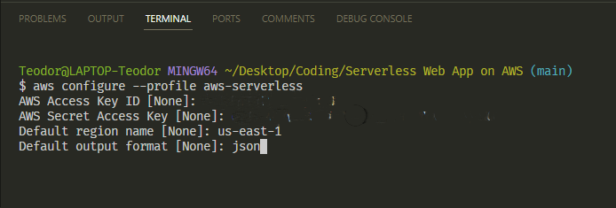

* To confirm the newly configured IAM user, just type:

```sh
cat ~/.aws/credentials
```
* You should see the default IAM Profile configured and the new `aws-serverless` IAM Profile

## Part 2: Host the Static Website

### Step 1: Create IAM policies, roles and permissions

* First, create a `providers.tf` file:

```sh
terraform {
  required_providers {
    aws = {
      source  = "hashicorp/aws"
      version = "~> 5.0"
    }
    external = {
      source  = "hashicorp/external"
      version = ">= 2.3.0"
    }
  }
}

provider "aws" {
  region = "us-east-1"
}
```

* Now, let's move on to the `iam.tf` file:

```sh
# Import the existing IAM user
data "aws_iam_user" "aws-serverless" {
  user_name = "aws-serverless"
}

resource "aws_iam_user_policy_attachment" "attach_codecommit_power_user" {
  user       = data.aws_iam_user.aws-serverless.user_name
  policy_arn = "arn:aws:iam::aws:policy/AWSCodeCommitPowerUser"
}

# Create a service role for Amplify
resource "aws_iam_role" "iam_role_amplify" {
  name = "amplify-role"

  assume_role_policy = jsonencode({
    Version = "2012-10-17",
    Statement = [
      {
        Action = "sts:AssumeRole",
        Effect = "Allow",
        Sid    = "",
        Principal = {
          Service = "amplify.amazonaws.com"
        }
      },
    ]
  })

  tags = {
    tag-key = "amplify-iam-role"
  }
}

resource "aws_iam_role_policy_attachment" "attach_admin_policy" {
  role       = aws_iam_role.iam_role_amplify.name
  policy_arn = "arn:aws:iam::aws:policy/AdministratorAccess-Amplify"
}

resource "aws_iam_role" "lambda_iam_role" {
  name = "lambda_execution_role"

  assume_role_policy = <<EOF
{
  "Version": "2012-10-17",
  "Statement": [
    {
      "Effect": "Allow",
      "Principal": {
        "Service": "lambda.amazonaws.com"
      },
      "Action": "sts:AssumeRole"
    }
  ]
}
EOF
}

resource "aws_iam_role_policy_attachment" "lambda_basic_execution_policy" {
  policy_arn = "arn:aws:iam::aws:policy/service-role/AWSLambdaBasicExecutionRole"
  role       = aws_iam_role.lambda_iam_role.name
}

resource "aws_iam_role_policy_attachment" "lambda_basic_s3_read_access_policy" {
  policy_arn = "arn:aws:iam::aws:policy/AmazonS3ReadOnlyAccess"
  role       = aws_iam_role.lambda_iam_role.name
}


resource "aws_iam_policy" "dynamodb_write_policy" {
  name        = "dynamodb_write_policy"
  description = "Policy allowing write access to DynamoDB table"

  policy = <<EOF
{
  "Version": "2012-10-17",
  "Statement": [
    {
      "Effect": "Allow",
      "Action": [
        "dynamodb:PutItem"
      ],
      "Resource": "arn:aws:dynamodb:us-east-1:342156789215:table/Wild-Rides-Table"
    }
  ]
}
EOF

  depends_on = [aws_dynamodb_table.Wild-Rides-Details-db]
}

resource "aws_iam_role_policy_attachment" "dynamodb_write_attachment" {
  policy_arn = aws_iam_policy.dynamodb_write_policy.arn
  role       = aws_iam_role.lambda_iam_role.name
}

# IAM Role for API Gateway execution
resource "aws_iam_role" "api_gateway_execution_role" {
  name               = "ApiGatewayExecutionRole"
  assume_role_policy = <<EOF
{
  "Version": "2012-10-17",
  "Statement": [
    {
      "Effect": "Allow",
      "Principal": {
        "Service": "apigateway.amazonaws.com"
      },
      "Action": "sts:AssumeRole"
    }
  ]
}
EOF
}

# Attach policies to the IAM role 
resource "aws_iam_role_policy_attachment" "api_gateway_execution_role_policy" {
  policy_arn = "arn:aws:iam::aws:policy/service-role/AmazonAPIGatewayPushToCloudWatchLogs"
  role       = aws_iam_role.api_gateway_execution_role.name
}
```

### Step 2: Create a CodeCommit Repository and DynamoDB with Terraform

```sh
resource "aws_codecommit_repository" "wild_rides" {
  repository_name = "wild-rides-repo"
  description     = "CodeCommit Repository for the Web App"
}

output "repository_url" {
  value = aws_codecommit_repository.wild_rides.clone_url_http
}
```
* Create a CodeCommit Credentials on AWS Console

- Go to IAM, click on "My security credentials", locate AWS CodeCommit credentials and click "Generate credentials". Download and save the them.

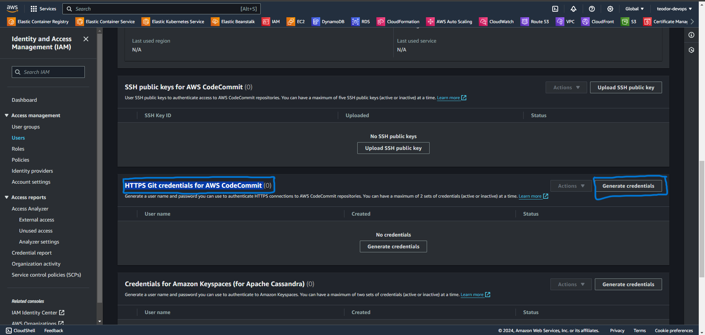

* Create a `dynamodb.tf` file:

```sh
resource "aws_dynamodb_table" "Wild-Rides-Details-db" {
  name           = "Wild-Rides-Table"
  billing_mode   = "PROVISIONED"
  read_capacity  = 10
  write_capacity = 10
  hash_key       = "RideId"

  attribute {
    name = "RideId"
    type = "S"
  }

  tags = {
    Name = "ProductionDB"
  }
}
```

* Then, type in your terminal:

```sh
terraform init
terraform validate
terraform plan
terraform apply -auto-approve
```
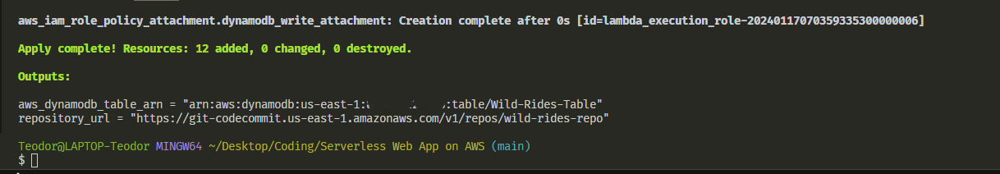

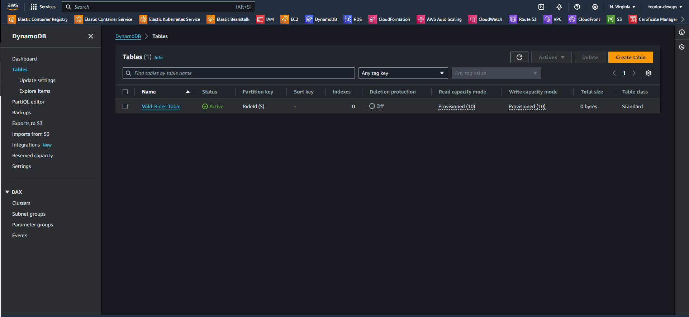

* Clone the CodeCommit Repo on your local system. You will get a message similar to the one below, enter the CodeCommit username and password created above.

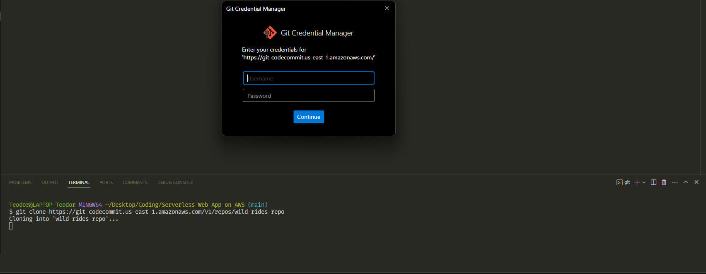

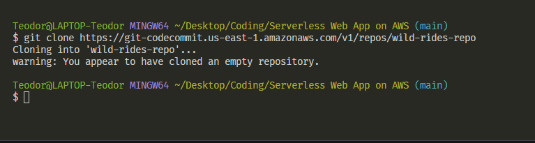

* Change the directory to the Clone Repo one and run the following commands to copy the Web App to the cloned repo:

```sh
aws s3 cp s3://wildrydes-us-east-1/WebApplication/1_StaticWebHosting/website ./wild-rides-repo --recursive
git add .
git commit -m "Added new files"
git push
```
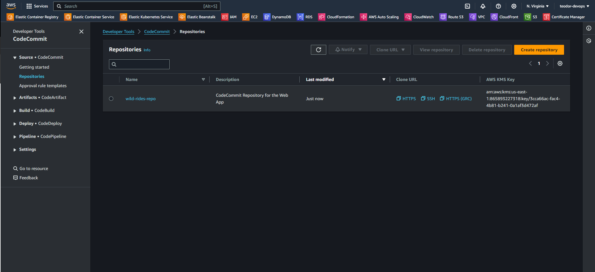

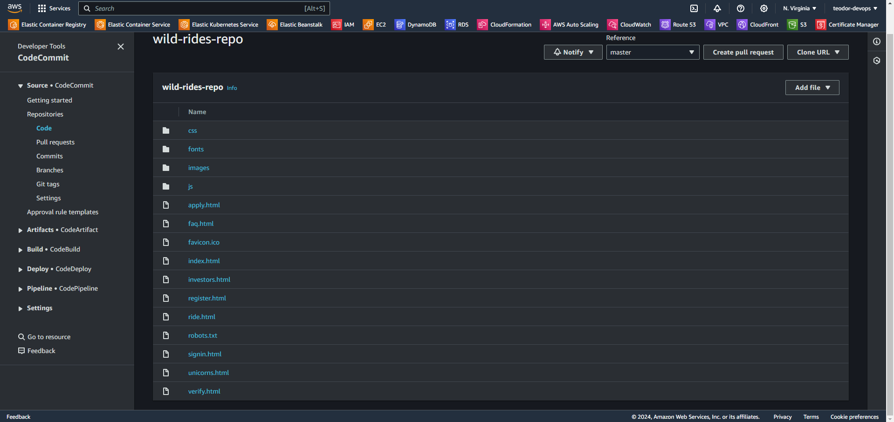

### Step 3: Create variables.tf, terraform.tfvars and amplify.tf

* Manage the `variables.tf`:

```sh
variable "web_app_name" {}
variable "codecommit_repo_url" {}
variable "codecommit_git_credential" {}
variable "codecommit_iam_username" {}
variable "codecommit_iam_password" {}
variable "app_branch" {}
variable "cognito_arn" {}
```

* Create also `terraform.tfvars` to assign values to the variables:

```sh
web_app_name              = "Wild Rydes"
codecommit_repo_url       = "https://git-codecommit.us-east-1.amazonaws.com/v1/repos/wild-rides-repo"
codecommit_iam_username   = "aws-serverless-at-342156789215"
codecommit_iam_password   = "Mkh5TcHAHqZtbR4wmKV8yXS1XTrPsLrHDdgo/+v/EEc="
codecommit_git_credential = "Mkh5TcHAHqZtbR4wmKV8yXS1XTrPsLrHDdgo/+v/EEc="
app_branch                = "master"
cognito_arn               = "arn:aws:cognito-idp:us-east-1:342156789215:userpool/us-east-1_W3iE8eUaB"
```
 ->> The `codecommit_git_credential` is the same as the `codecommit_iam_password` earlier created. Insert the appropriate parameters in the string.
 ->> You should comment out `cognito_arn`. We will uncomment it when we create `cognito.tf` file.
 ->> In the `variables.tf` file above, comment out `variable cognito_arn` for now, so that we can test the frontend website without any errors in our terraform code.

 * Create `amplify.tf` file:

 ```sh
 resource "aws_amplify_app" "my_amplify_app" {
  name                 = "Wild-Rides-Amplify-App"
  repository           = var.codecommit_repo_url
  oauth_token          = var.codecommit_git_credential
  iam_service_role_arn = aws_iam_role.iam_role_amplify.arn

  build_spec = <<BUILD_SPEC
  version: 1
  frontend:
    phases:
      build:
        commands: []
    artifacts:
      baseDirectory: /
      files:
        - '**/*'
    cache:
      paths: []
  BUILD_SPEC            
}

resource "aws_amplify_branch" "main" {
  app_id      = aws_amplify_app.my_amplify_app.id
  branch_name = var.app_branch
}
 ```

* Now type:

```sh
terraform plan
terraform apply -auto-approve
```

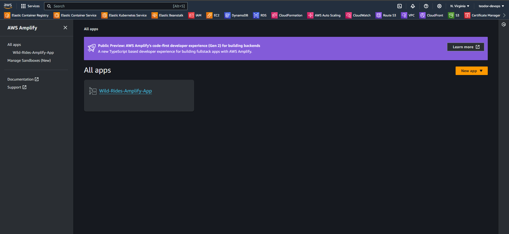

* Make a small change to the website code and push to CodeCommit repository. Then check the amplify console:

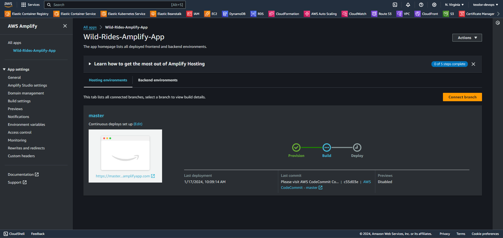
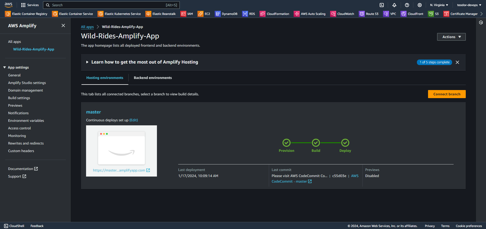
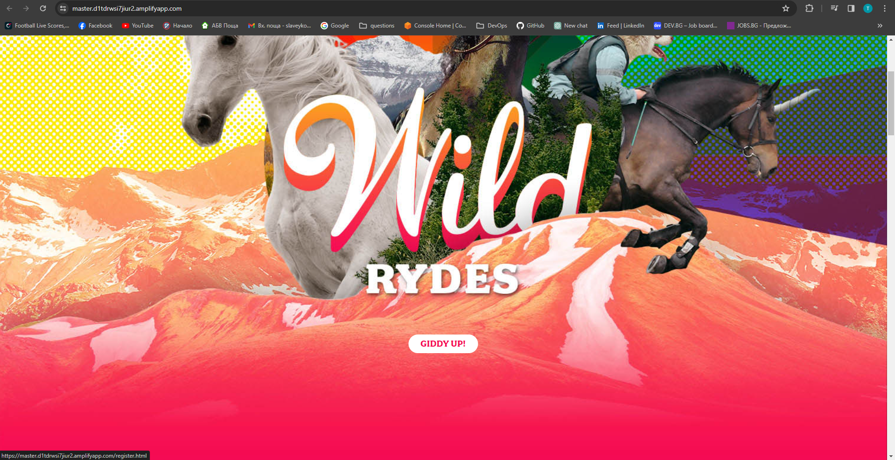

## Part 3: Adding User Sign-in functionality using Cognito

### Step 1: Create `cognito.tf` file

```sh
resource "aws_cognito_user_pool" "pool" {
  name              = "wild-rides-user-pool"
  mfa_configuration = "OFF"

  admin_create_user_config {
    allow_admin_create_user_only = false
  }

  alias_attributes = ["phone_number", "email", "preferred_username"]
  password_policy {
    minimum_length    = 8
    require_lowercase = true
    require_uppercase = true
    require_numbers   = true
    require_symbols   = true
  }
  auto_verified_attributes = ["email"]

  verification_message_template {
    default_email_option = "CONFIRM_WITH_CODE"
    email_subject        = "YOUR VERIFICATION CODE"
    email_message        = "This is your confirmation code: {####}"
  }

  email_configuration {
    email_sending_account = "COGNITO_DEFAULT"
  }
}

resource "aws_cognito_user_pool_client" "pool_client" {
  name         = "my-client"
  user_pool_id = aws_cognito_user_pool.pool.id
}

output "userpool_id" {
  value = aws_cognito_user_pool.pool.id
}

output "client_id" {
  value = aws_cognito_user_pool_client.pool_client.id
}
```

```sh
terraform plan
terraform apply -auto-approve
``` 
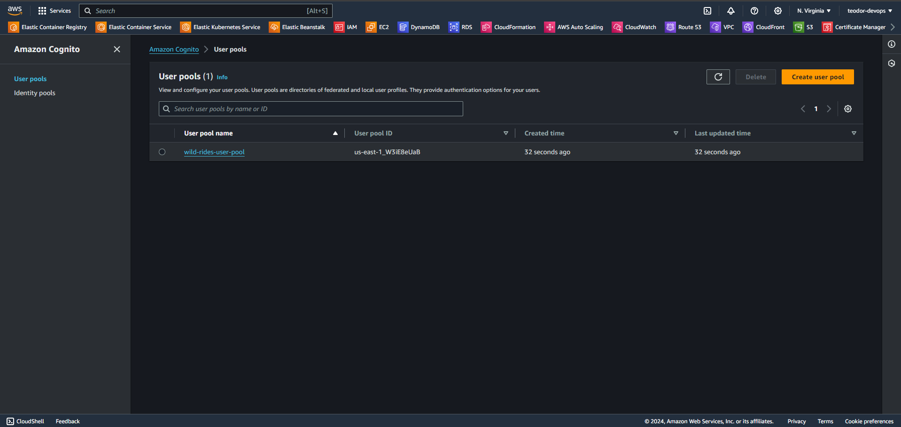

* You should now see the UserPoolId and ClientPoolID as output in the console! Copy the output values and go to `wild-rides-repo` -> js -> config.js . Put your output values in there!

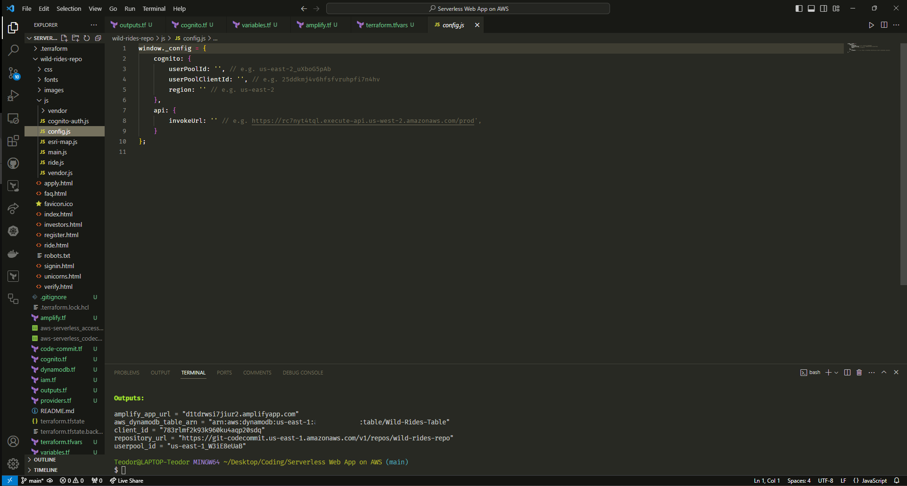

### Step 2: Check the Web App to confirm the Login. Register!!

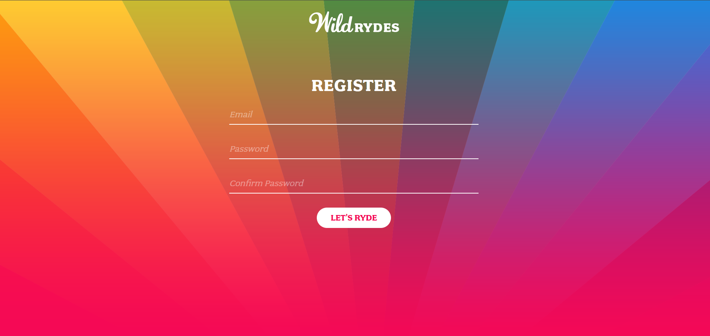
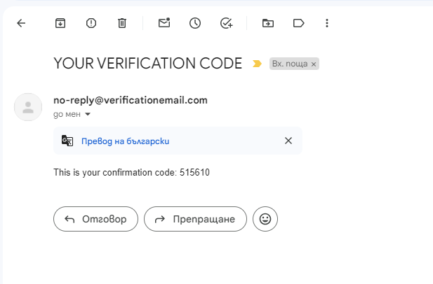
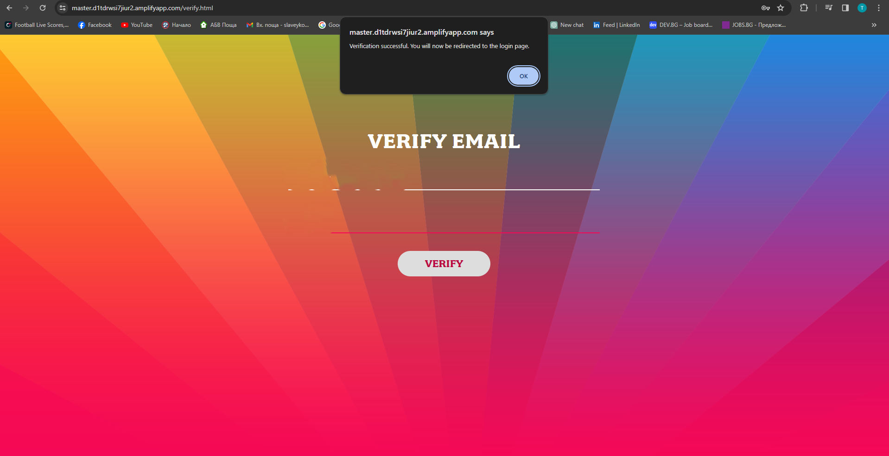
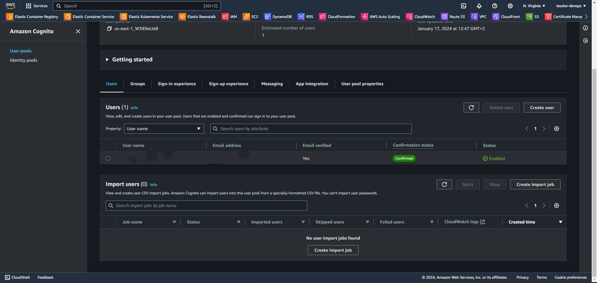

* When logged in, you will get a page similar to the one below with an authorization token, which we will use later.

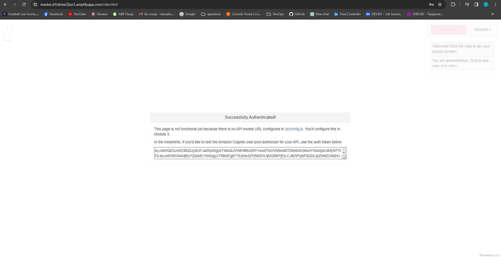

## Part 4: Handle the backend logic

### Step 1: Create `s3.tf` file / Bucket

```sh
resource "aws_s3_bucket" "s3-bucket" {
    bucket = "wild-rides-serverless" 
}

resource "aws_s3_bucket_public_access_block" "s3-bucket-block" {
  bucket = aws_s3_bucket.s3-bucket.id
  block_public_acls = true
  block_public_policy = true
  ignore_public_acls = true
  restrict_public_buckets = true
}

data "archive_file" "source" {
  type = "zip"
  source_dir = "./wild-rides-repo/"
  output_path = "./wild-rides-repo/index.zip"
}

# Upload the zip file to S3 Bucket
resource "aws_s3_object" "lambda-function-code" {
  bucket = aws_s3_bucket.s3-bucket.bucket
  source = data.archive_file.source.output_path
  key = "index.zip"
  acl = "private"

  depends_on = [ aws_s3_bucket.s3-bucket ]
}
```

### Step 2: Create `lambda.tf`

```sh
# Create Lambda Function
resource "aws_lambda_function" "wild_rides_lambda" {
  function_name = "wild-rides-function"
  handler       = "index.handler"
  runtime       = "nodejs16.x"
  role          = aws_iam_role.lambda_iam_role.arn
  memory_size   = 128
  timeout       = 60
  s3_bucket     = aws_s3_bucket.s3-bucket.bucket
  s3_key        = aws_s3_object.lambda-function-code.key
  depends_on    = [aws_iam_role.lambda_iam_role, aws_s3_bucket.s3-bucket, aws_s3_object.lambda-function-code]

  environment {
    variables = {
      TABLE_NAME = "Wild-Rides-Table"
    }
  }
}

# Invoke Lambda Function
resource "aws_lambda_invocation" "invoke_test_event" {
  function_name = aws_lambda_function.wild_rides_lambda.function_name
  input         = <<EOT
 {
    "path": "/ride",
    "httpMethod": "POST",
    "headers": {
        "Accept": "*/*",
        "Authorization": "eyJraWQiOiJLTzRVMWZs",
        "content-type": "application/json; charset=UTF-8"
    },
    "queryStringParameters": null,
    "pathParameters": null,
    "requestContext": {
        "authorizer": {
            "claims": {
                "cognito:username": "the_username"
            }
        }
    },
    "body": "{\"PickupLocation\":{\"Latitude\":47.6174755835663,\"Longitude\":-122.28837066650185}}"
}

  EOT

  depends_on = [aws_lambda_function.wild_rides_lambda]
}

output "lambda_output" {
  value = aws_lambda_invocation.invoke_test_event.result
}
```

### Step 3: Create `api-gw.tf`:

```sh
# Create API Gateway REST API
resource "aws_api_gateway_rest_api" "serverless_api" {
  name        = "ServerlessRESTAPI"
  description = "Serverless REST API for the Web App"
  endpoint_configuration {
    types = ["EDGE"]
  }
}

# Enable CORS for the API
resource "aws_api_gateway_resource" "resource" {
  rest_api_id = aws_api_gateway_rest_api.serverless_api.id
  parent_id   = aws_api_gateway_rest_api.serverless_api.root_resource_id
  path_part   = "ride"

  depends_on = [aws_api_gateway_rest_api.serverless_api]
}

# Create Method and Method Response for OPTIONS
resource "aws_api_gateway_method" "options_method" {
  rest_api_id      = aws_api_gateway_rest_api.serverless_api.id
  resource_id      = aws_api_gateway_resource.resource.id
  http_method      = "OPTIONS"
  authorization    = "NONE"
  api_key_required = "false"

  depends_on = [aws_api_gateway_resource.resource]
}

# Create Lambda Integration
resource "aws_api_gateway_integration" "integration" {
  rest_api_id             = aws_api_gateway_rest_api.serverless_api.id
  resource_id             = aws_api_gateway_resource.resource.id
  http_method             = aws_api_gateway_method.options_method.http_method
  integration_http_method = "OPTIONS"
  type                    = "MOCK"
  uri                     = aws_lambda_function.wild_rides_lambda.invoke_arn

  depends_on = [aws_api_gateway_method.options_method]
}

# Create Post Method
resource "aws_api_gateway_method" "post_method" {
  rest_api_id   = aws_api_gateway_rest_api.serverless_api.id
  resource_id   = aws_api_gateway_resource.resource.id
  http_method   = "POST"
  authorization = "COGNITO_USER_POOLS"
  authorizer_id = aws_api_gateway_authorizer.cognito_authorizer.id

  depends_on = [aws_api_gateway_rest_api.serverless_api]
}

resource "aws_api_gateway_method_response" "post_method_response" {
  rest_api_id = aws_api_gateway_rest_api.serverless_api.id
  resource_id = aws_api_gateway_resource.resource.id
  http_method = aws_api_gateway_method.post_method.http_method
  status_code = 200

  response_parameters = {
    "method.response.header.Access-Control-Allow-Origin" = true,
  }

  response_models = {
    "application/json" = "Empty"
  }

  depends_on = [aws_api_gateway_method.post_method]
}

# Create Cognito User Pools authorizer
resource "aws_api_gateway_authorizer" "cognito_authorizer" {
  name                   = "CognitoAuthorizer"
  rest_api_id            = aws_api_gateway_rest_api.serverless_api.id
  type                   = "COGNITO_USER_POOLS"
  identity_source        = "method.request.header.Authorization"
  provider_arns          = [var.cognito_arn]
  authorizer_credentials = aws_iam_role.api_gateway_execution_role.arn
}

resource "aws_api_gateway_integration" "post_integration" {
  rest_api_id             = aws_api_gateway_rest_api.serverless_api.id
  resource_id             = aws_api_gateway_resource.resource.id
  http_method             = aws_api_gateway_method.post_method.http_method
  integration_http_method = "POST"
  type                    = "AWS_PROXY"
  uri                     = aws_lambda_function.wild_rides_lambda.invoke_arn
}

# Create a deployment for the API Gateway
resource "aws_api_gateway_deployment" "deployment" {
  depends_on  = [aws_api_gateway_integration.integration]
  rest_api_id = aws_api_gateway_rest_api.serverless_api.id
  stage_name  = "prod"  
}

output "api_gateway_invoke_url" {
  value = aws_api_gateway_deployment.deployment.invoke_url
}
```

* Next, Navigate to the App code directory and create an `index.js` file and paste the code below in it. This is the lambda function file which will be zipped for upload via the terraform code.

```sh
const randomBytes = require('crypto').randomBytes;
const AWS = require('aws-sdk');
const ddb = new AWS.DynamoDB.DocumentClient();

const fleet = [
	{
    	Name: 'Angel',
    	Color: 'White',
    	Gender: 'Female',
	},
	{
    	Name: 'Gil',
    	Color: 'White',
    	Gender: 'Male',
	},
	{
    	Name: 'Rocinante',
    	Color: 'Yellow',
    	Gender: 'Female',
	},
];

exports.handler = (event, context, callback) => {
	if (!event.requestContext.authorizer) {
  	errorResponse('Authorization not configured', context.awsRequestId, callback);
  	return;
	}

	const rideId = toUrlString(randomBytes(16));
	console.log('Received event (', rideId, '): ', event);
    const username = event.requestContext.authorizer.claims['cognito:username'];
	const requestBody = JSON.parse(event.body);
	const pickupLocation = requestBody.PickupLocation;
	const unicorn = findUnicorn(pickupLocation);

	recordRide(rideId, username, unicorn).then(() => {
    	callback(null, {
        	statusCode: 201,
        	body: JSON.stringify({
            	RideId: rideId,
            	Unicorn: unicorn,
            	Eta: '30 seconds',
            	Rider: username,
        	}),
        	headers: {
            	'Access-Control-Allow-Origin': '*',
        	},
    	});
	}).catch((err) => {
    	console.error(err);
    	errorResponse(err.message, context.awsRequestId, callback)
	});
};


function findUnicorn(pickupLocation) {
	console.log('Finding unicorn for ', pickupLocation.Latitude, ', ', pickupLocation.Longitude);
	return fleet[Math.floor(Math.random() * fleet.length)];
}

function recordRide(rideId, username, unicorn) {
	return ddb.put({
    	TableName: 'Wild-Rides-Table',
    	Item: {
        	RideId: rideId,
        	User: username,
        	Unicorn: unicorn,
        	RequestTime: new Date().toISOString(),
    	},
	}).promise();
}

function toUrlString(buffer) {
	return buffer.toString('base64')
    	.replace(/\+/g, '-')
    	.replace(/\//g, '_')
    	.replace(/=/g, '');
}

function errorResponse(errorMessage, awsRequestId, callback) {
  callback(null, {
	statusCode: 500,
	body: JSON.stringify({
  	Error: errorMessage,
  	Reference: awsRequestId,
	}),
	headers: {
  	'Access-Control-Allow-Origin': '*',
	},
  });
}
```
* Now, compress the file using the zip utility!

```sh
terraform plan
terraform apply -auto-approve
```
* You can check the AWS console to view the services deployed.

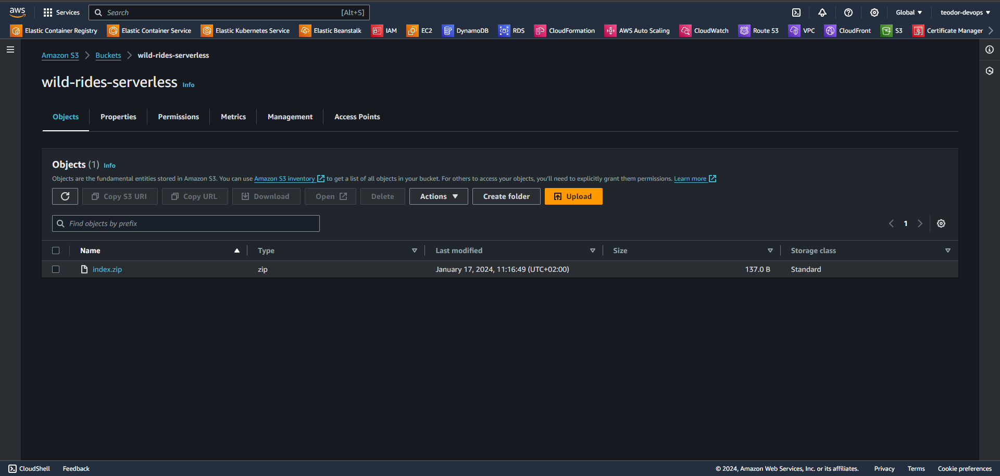
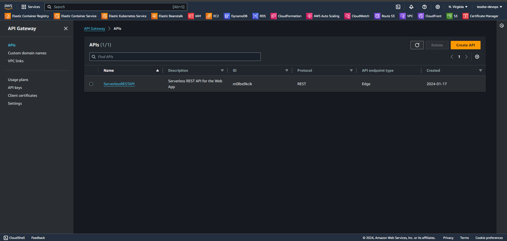
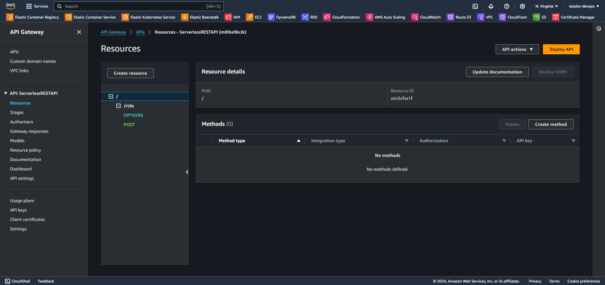
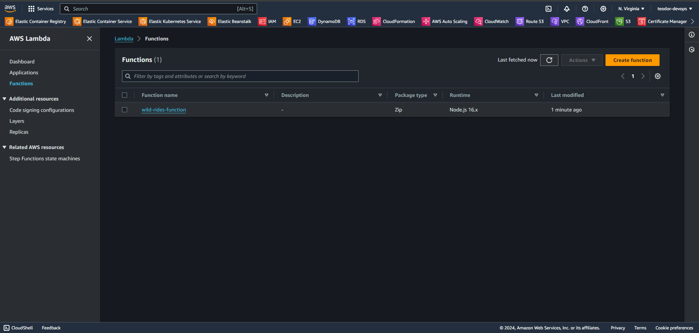
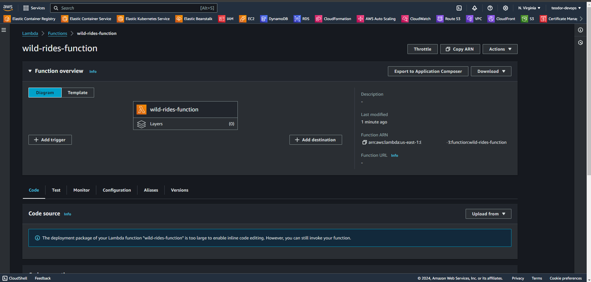

* Now go to the website where you have received an authentication token.


* Copy the token and paste it in `APi Gateway` => `Authorizers`. Click on `Test authorizer`

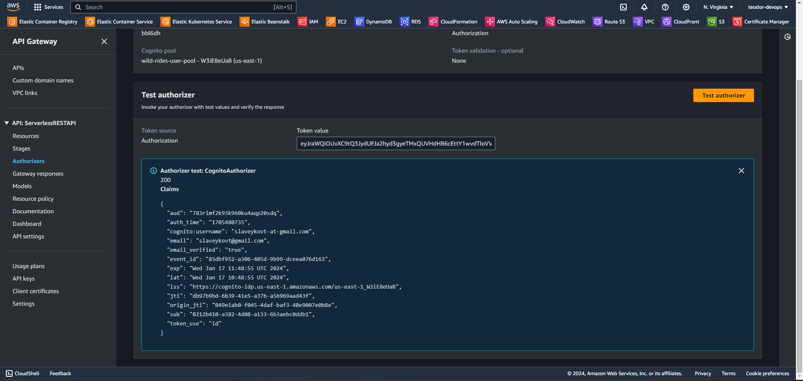

### Step 4: Modify `config.js` file with the API Invoke URL that you received in the console as output


## Part 5: CI/CD with GitHub Actions

* This is where I stored my Web App Repo and integrated the workflow: https://github.com/teodor1006/wild-rydes-repo

* We will use GitHub actions to synchronize application code changes from the GitHub repo to the codecommit repo. Navigate to the App Code Repository, in the root directory, create .github/workflows directory, then build main.yml file(you can give it any name you like but it must be a yaml file).

* Navigate to the web app repo settings, click on Secrets and Variables, then click on Actions, then create the following as environment secrets.

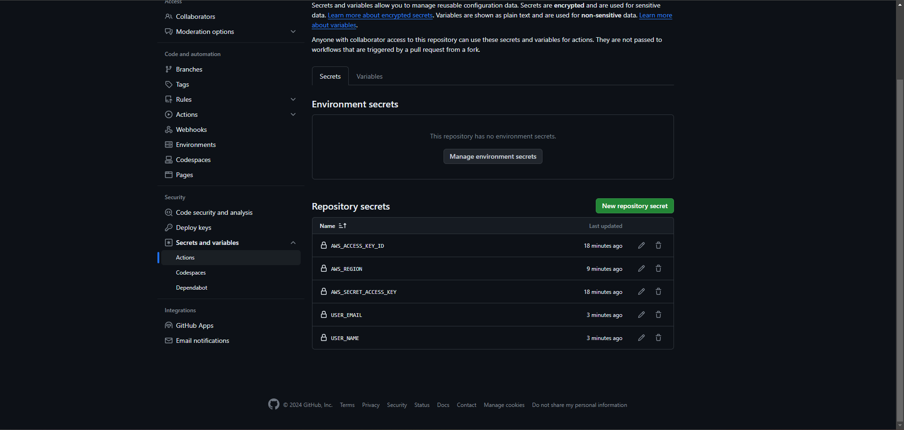

* In the `main.yml` file, paste the following code: 

```sh
name: Synchronize with AWS CodeCommit

on: push    # workflow_dispatch

jobs:
  Sync:
    runs-on: ubuntu-latest

    steps:
      - name: Code checkout
        uses: actions/checkout@v4
        with:
          fetch-depth: 0

      - name: Configure AWS Credentials
        uses: aws-actions/configure-aws-credentials@v1
        with:
          aws-access-key-id: ${{ secrets.AWS_ACCESS_KEY_ID }}
          aws-secret-access-key: ${{ secrets.AWS_SECRET_ACCESS_KEY }}
          aws-region: ${{ secrets.AWS_REGION }}

      - name: Install Git-Remote-CodeCommit package
        run: |
          pip install git-remote-codecommit 

      - name: Configure Git User Identity
        run: |
          git config --global user.email "${{ secrets.USER_EMAIL }}"
          git config --global user.name  "${{ secrets.USER_NAME }}"

      - name: Sync with AWS CodeCommit
        run: |
          git config --global credential.helper '!aws codecommit credential-helper $@'
          git config --global credential.UseHttpPath true
        
          git remote add codecommit codecommit::us-east-1://wild-rides-repo
       
          git push codecommit main
```

* If you make a change to the `index.html` file of the app code and push to the remote github repo, Github Actions will pick the change build and push to the codecommit repository. For example, I will change “GIDDY UP!” (signup button) to “Sign Up Now!!!” and push to the remote GitHub repository.

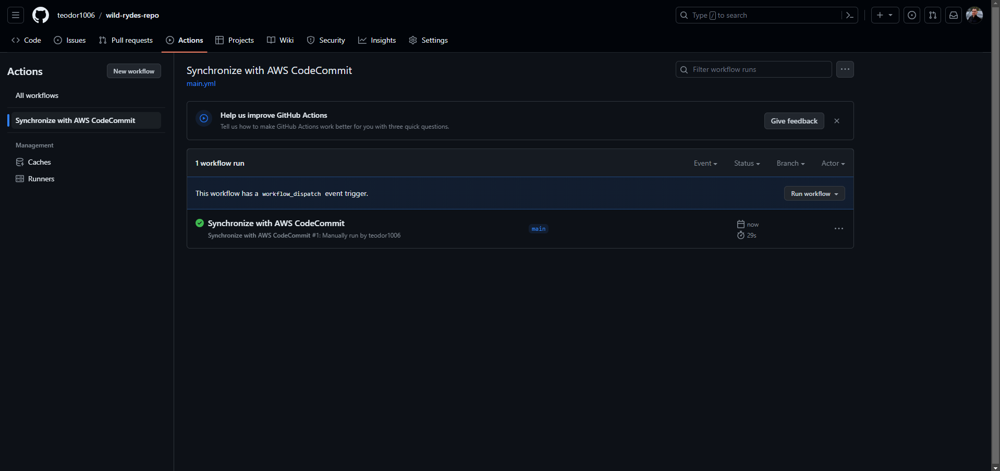

* Now the changes are immediately visible on Web App


* After that Sign In and you should see the following:

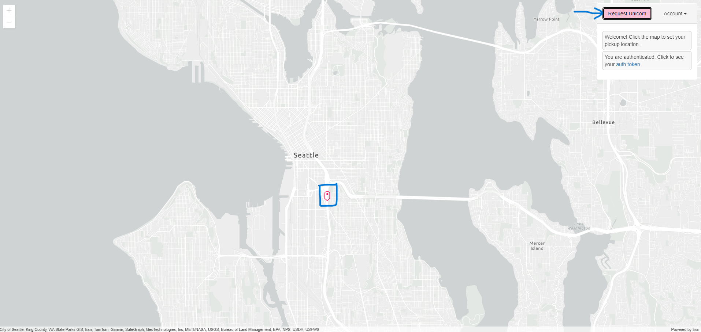

* You can now pick a destination and select `Request Unicorn`.

* Now let's remove our terraform files:

```sh
terraform destroy -auto-approve
```
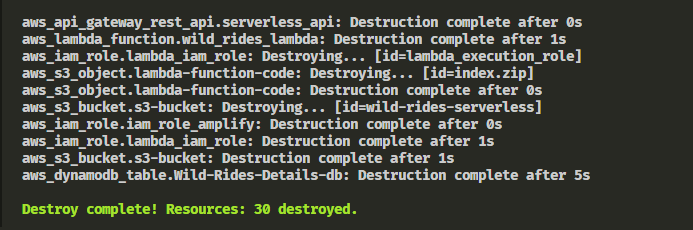


